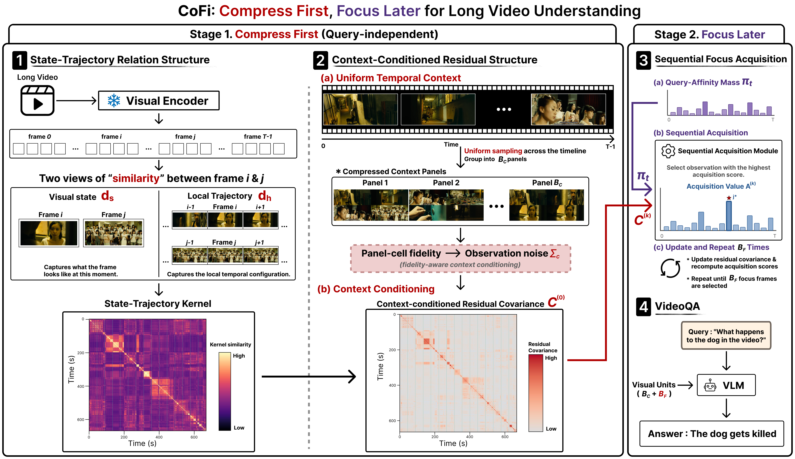

# CoFi: Compress First, Focus Later for Long Video Understanding

Official implementation of **CoFi**, a training-free visual input construction
framework for long-video question answering.

> The paper link, author list, and citation will be added after the anonymous
> review period.

<p align="center">
  
</p>

## Introduction

Video-LLMs can process only a limited number of visual units from a long
video. Existing keyframe selection methods therefore focus primarily on
finding query-relevant frames, which can omit the global context needed to
interpret those frames. CoFi explicitly separates the two roles:

1. **Compress First** uniformly samples the video and packs the observations
   into compact 2x2 context panels.
2. **Focus Later** estimates what remains unexplained by the compressed
   context and sequentially acquires full-resolution, query-relevant frames.

Our default `C4+F28` configuration presents 32 visual units to the Video-LLM:
four 2x2 context panels and 28 standalone focus frames. It is training-free
and can be applied to a frozen visual encoder and Video-LLM.

## Requirements

The released environment reproduces the following setup:

- Python 3.10.20
- PyTorch 2.5.1 + CUDA 12.1
- Transformers 4.49.0
- SigLIP SO400M/14 at 384 px
- LLaVA-Video-7B-Qwen2
- one CUDA GPU for Video-LLM inference (experiments used an RTX A6000 48 GB)

Create the environment with Miniconda:

```bash
git clone https://github.com/Anonymous-CoFi/CoFi.git
cd CoFi
conda env create -f environment.yml
conda activate cofi
```

Alternatively, install the pinned Python dependencies directly:

```bash
conda create -n cofi python=3.10.20 -y
conda activate cofi
pip install -r requirements.txt
pip install -e .
```

CoFi uses the official LLaVA-NeXT inference implementation. Clone the pinned
revision outside or inside this repository:

```bash
git clone https://github.com/LLaVA-VL/LLaVA-NeXT.git third_party/LLaVA-NeXT
git -C third_party/LLaVA-NeXT checkout df179663ae8b83207df100a1f7af24caec633ff9
```

The default configuration pins the model snapshots used in our experiments:

| Component | Model / revision |
|---|---|
| Visual encoder | `google/siglip-so400m-patch14-384` |
| SigLIP revision | `9fdffc58afc957d1a03a25b10dba0329ab15c2a3` |
| Video-LLM | `lmms-lab/LLaVA-Video-7B-Qwen2` |
| Video-LLM revision | `013210b3aff822f1558b166d39c1046dd109520f` |

The reported experiments are visual-only; subtitles are not appended to the
Video-LLM prompt.

## Datasets

Download the official videos and annotations for:

- Video-MME
- MLVU-Dev
- LongVideoBench validation set

The dataset adapters recursively resolve MP4 files under the supplied dataset
root. Their default annotation locations are:

| Dataset | Default annotation |
|---|---|
| Video-MME | `<root>/videomme/test-00000-of-00001.parquet` |
| MLVU-Dev | `<root>/MLVU/json/{1..7}_*.json` |
| LongVideoBench | `<root>/lvb_val.json` |

For exact MLVU reproduction, use the normalized MLVU-Dev JSON used by the
evaluation protocol and pass it through `--annotation`. The supplied MLVU
scripts expose `/path/to/your/mlvu_dev.json` for this purpose.

## Quick Start

Each benchmark provides four runnable scripts:

```text
scripts/<dataset>/
├── preprocess.sh          # sample 1-fps candidates and cache embeddings
├── select.sh              # construct and save CoFi visual units
├── reasoning.sh           # evaluate saved visual units with LLaVA-Video
└── select_and_reason.sh   # selection and reasoning in one command
```

First replace the placeholder paths in the scripts:

- `/path/to/your/<dataset>`
- `/path/to/your/mlvu_dev.json` for exact MLVU reproduction
- `/path/to/your/LLaVA-NeXT`

Then run, for example, Video-MME:

```bash
bash scripts/videomme/preprocess.sh
bash scripts/videomme/select.sh
bash scripts/videomme/reasoning.sh
```

Selection and reasoning can also be run together after preprocessing:

```bash
bash scripts/videomme/select_and_reason.sh
```

Use the corresponding directory for the other benchmarks:

```bash
bash scripts/mlvu/preprocess.sh
bash scripts/mlvu/select_and_reason.sh

bash scripts/longvideobench/preprocess.sh
bash scripts/longvideobench/select_and_reason.sh
```

## Pipeline

### 1. Preprocessing

Preprocessing is question-independent and is performed once per unique video.
It samples the exact 1-fps candidate timeline and caches source frame indices,
timestamps, and frozen SigLIP embeddings:

```bash
cofi preprocess \
  --dataset videomme \
  --dataset-root /path/to/your/Video-MME \
  --config configs/cofi_c4_f28.json \
  --cache-dir cache/videomme_siglip_1fps \
  --device cuda
```

### 2. Visual-unit selection

CoFi builds context panels, conditions the state-trajectory kernel on those
compressed observations, and sequentially selects the focus frames:

```bash
cofi select \
  --dataset videomme \
  --dataset-root /path/to/your/Video-MME \
  --config configs/cofi_c4_f28.json \
  --cache-dir cache/videomme_siglip_1fps \
  --routes-output outputs/videomme/cofi_routes.jsonl \
  --device cuda
```

The route file records the chronological 32 visual units used by the
Video-LLM, including every source frame and timestamp.

### 3. Video-LLM reasoning

```bash
cofi reason \
  --config configs/cofi_c4_f28.json \
  --routes-input outputs/videomme/cofi_routes.jsonl \
  --output outputs/videomme/cofi_predictions.jsonl \
  --metrics-output outputs/videomme/metrics.json \
  --llava-next-path /path/to/your/LLaVA-NeXT
```

Inference uses bfloat16, PyTorch SDPA, greedy decoding
(`do_sample=False`), and 16 generated tokens. Video-MME metrics include
short, medium, long, and overall accuracy; MLVU and LongVideoBench report
overall accuracy.

## Default Configuration

The paper setting is stored in
[`configs/cofi_c4_f28.json`](configs/cofi_c4_f28.json).

| Setting | Value |
|---|---:|
| Candidate sampling | 1 fps |
| Context panels | 4 |
| Frames per panel | 4 |
| Focus frames | 28 |
| Total visual units | 32 |
| Candidate relevance mass | 0.8 |
| State weight | 0.5 |
| Local trajectory radius | 1 |
| Panel canvas / cell size | 384 / 192 px |

When changing the candidate FPS, encoder, encoder revision, or panel-cell
size, use a new cache directory or add `--overwrite` to preprocessing.

## Repository Structure

```text
CoFi/
├── configs/                 # paper configuration
├── figure/                  # framework figure
├── scripts/
│   ├── videomme/
│   ├── mlvu/
│   └── longvideobench/      # benchmark-specific entry points
├── src/cofi/                # preprocessing, selection, and reasoning
├── environment.yml
└── requirements.txt
```

## Citation

The BibTeX entry will be added after publication. During anonymous review,
please refer to this repository as the official anonymous implementation of
CoFi.

## Acknowledgement

We thank the authors of LLaVA-NeXT/LLaVA-Video, SigLIP, Video-MME, MLVU, and
LongVideoBench for releasing their models, code, and benchmarks.
